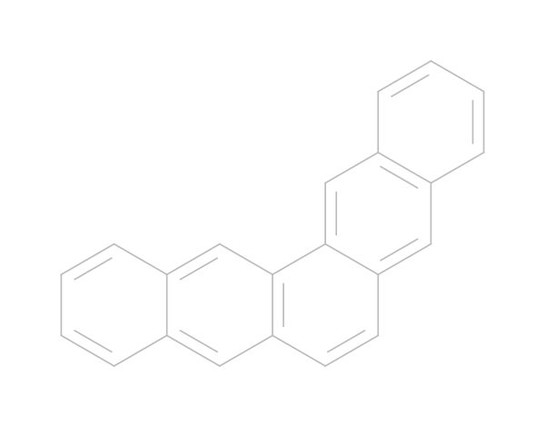

# Database with potential chromofores for singlet fission

A database consisting of potential chromophores for singlet fission based on exsisting chromophores that are bridged with PAH. 

The bridges that are used are:
    tetracene:
    pentacene:

Each bridge has its own directory in which all of the posible ways of connecting the molecule assuming some symmetry-preserving properties of the bridge are used. 
Each file is stored in a `.mol` file with encoded filename:
`<bridge_type>_<monomer_type>_<id>.mol`

