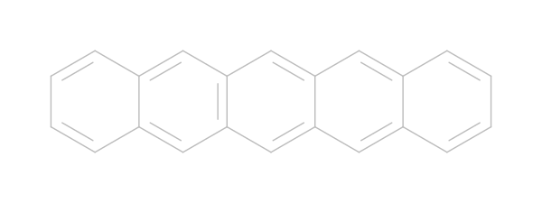
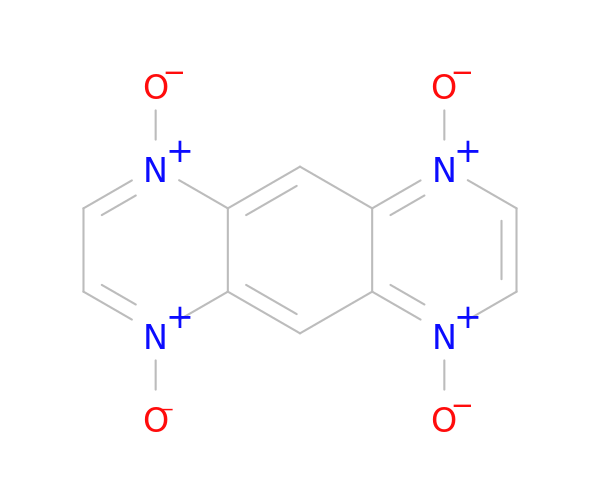
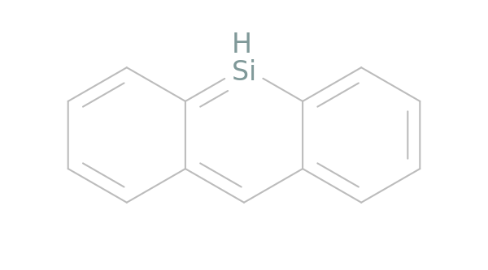
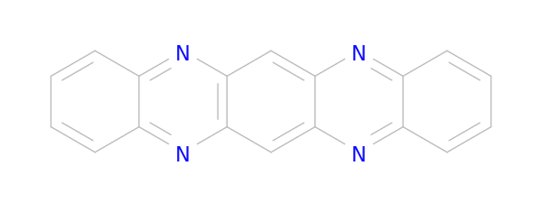

# Dimer-DB

A database consisting of potential chromophores for singlet fission based on exsisting chromophores that are bridged with PAH. 

---

The database is sectioned into parts by the bridge type that connects the two monomers. Because there are multiple ways to connect the two monomers to the bridge symmetrically (to the bridge), the database follows the filename notation:

```
*Folder*: <bridge_type>/
<bridge_code>_<monomer_code>_<id>.mol
```
Where:
- `<bridge_type>` describes the type of bridge used (pentacene, teracene, etc.)
- `<bridge_code>` describes the connection type to the bridge (see [bridge-codes])
- `<monomer_code>` describes the monomer used to make the dimer
- `<id>` is an index that counts the ways that a monomer can connect to a bridge type with a specific bridge code such that there are no unique molecules 

## Monomer codes [monomer-codes]

| Code | Image | SMILES |
|:---:|---|---:|
|  0 || c12cc3ccccc3cc1ccc1cc3ccccc3cc12|
|  1 || c12c3cccc1c1cccc4c1c(ccc4)c2ccc3|
|  2 || s1cc2cc3cc4ccccc4cc3cc2c1|
|  3 || c1ccccc1|
|  4 || c12c3cccc1ccc1cccc(c12)cc3|
|  5 || c1ccc2cc3cc4cc5cc6ccccc6cc5cc4cc3cc2c1|
|  6 || c1ccc2c(C#N)c3ccccc3c(C#N)c2c1|
|  7 || c1ccc2cc3cc4ccccc4cc3cc2c1|
|  8 || c12cc3cc4ccccc4cc3cc1cc1ccccc1c2|
|  9 || c1ccc2cc3cc4cc5ccccc5cc4cc3cc2c1|
| 10 ||\[O-\]\[n+\]1cc\[n+\](\[O-\])c2cc3c(cc12)\[n+\](\[O-\])cc\[n+\]3\[O-\]|
| 11 ||c1cc2cc3c(cccc3)=\[SiH\]c2cc1|
| 12 ||c12c3ccc4cccc(c41)ccc2cc1ccccc13|
| 13 ||c1ccc2ccccc2c1|
| 14 ||c1ccc2cc3ccccc3cc2c1|
| 15 ||c12c3cccc1c1cccc4c1c(bnc4)c2bnc3|
| 16 ||c12nc3cc4ccccc4cc3nc1cc1ccccc1c2|
| 17 ||c12c(c3ccccc3)oc(c3ccccc3)c1cccc2|
| 18 ||c12cc3nc4ccccc4nc3cc1nc1c(n2)cccc1|
| 19 ||c12cc3nc4ccccc4cc3cc1nc1ccccc1c2|
| 20 ||c12cc3nc4ccccc4cc3cc1cc1ccccc1c2|
| 21 ||s1ccc2cc3c(cc12)cc1cc2sccc2cc1c3|

## Bridge codes [bridge-codes] 

### Tetracene 

### Pentacene 
