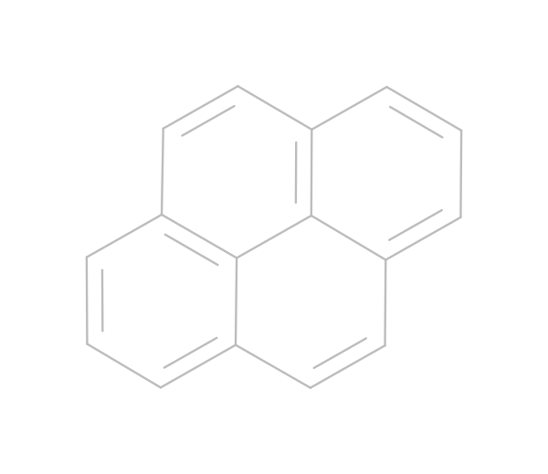
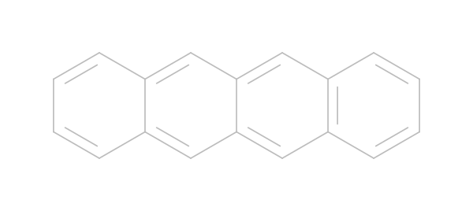
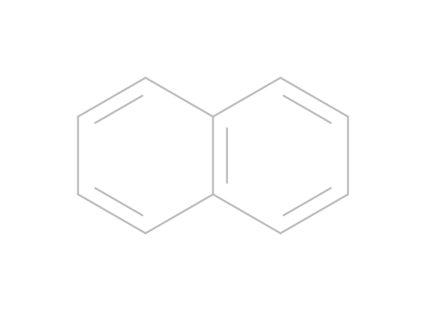

# Database with potential chromofores for singlet fission

A database consisting of potential chromophores for singlet fission based on exsisting chromophores that are bridged with PAH. 

The bridges that are used are:
 - tetracene: 
 - pentacene: 

Each bridge has its own directory in which all of the posible ways of connecting the molecule assuming some symmetry-preserving properties of the bridge are used. 
Each file is stored in a `.mol` file with encoded filename:
`<bridge_type>_<monomer_type>_<id>.mol`

 Monomers 

## Monomers

| Monomer | Code |
|---|---|
|| 0 |
|| 1 |
|| 2 |
|| 3 |
|| 4 |
|| 5 |
|| 6 |
|| 7 |
|| 8 |
|| 9 |
|| 10 |
|| 11 |
|| 12 |
|| 13 |
|| 14 |
|| 15 |
|| 16 |
|| 17 |
|| 18 |
|| 19 |
|| 20 |
|| 21 |

