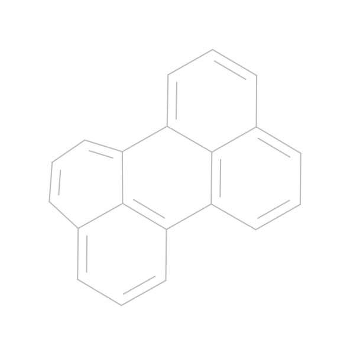
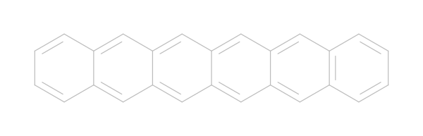

# Database with potential chromofores for singlet fission

A database consisting of potential chromophores for singlet fission based on exsisting chromophores that are bridged with PAH. 

The bridges that are used are:
 - tetracene: 
 - pentacene: 

The database is sectioned into parts by the bridge type that connects the two monomers. Because there are multiple ways to connect the two monomers to the bridge symmetrically (to the bridge), each folder has files with the following filename notation:

```
<bridge_code>_<monomer_code>_<id>.mol
```

<details>

<summary> Monomer codes </summary>

## Monomer codes

| Code | Image | Smiles |
|---|---|---|
|  0 || C12=CC3=CC=CC=C3C=C1C=CC1=CC3=CC=CC=C3C=C12|
|  1 || C12=C3C=CC=C1C1=CC=CC4=C1C(=CC=C4)C2=CC=C3|
|  2 || S1C=C2C=C3C=C4C=CC=CC4=CC3=CC2=C1|
|  3 || C1=CC=CC=C1|
|  4 || C12=C3C=CC=C1C=CC1=CC=CC(=C12)C=C3|
|  5 || C1=CC=C2C=C3C=C4C=C5C=C6C=CC=CC6=CC5=CC4=CC3=CC2=C1|
|  6 || C1:C=C:C2:C(C#N):C3:C=C:C=C:C:3:C(C#N):C:2:C=1|
|  7 || C1=CC=C2C=C3C=C4C=CC=CC4=CC3=CC2=C1|
|  8 || C12=CC3=CC4=CC=CC=C4C=C3C=C1C=C1C=CC=CC1=C2|
|  9 || C1=CC=C2C=C3C=C4C=C5C=CC=CC5=CC4=CC3=CC2=C1|
| 10 ||\[O-\]\[N+\]1=CC=\[N+\](\[O-\])C2C=C3C(=CC12)\[N+\](\[O-\])=CC=\[N+\]3\[O-\]|
| 11 ||C1=CC2=CC3=C(C=CC=C3)\[SiH\]=C2C=C1|
| 12 ||C12=C3C=CC4=CC=CC(=C41)C=CC2=CC1=CC=CC=C13|
| 13 ||C1=CC=C2C=CC=CC2=C1|
| 14 ||C1=CC=C2C=C3C=CC=CC3=CC2=C1|
| 15 ||C12=C3C=CC=C1C1=CC=CC4=C1C(=BN=C4)C2=BN=C3|
| 16 ||C12=NC3=CC4=CC=CC=C4C=C3N=C1C=C1C=CC=CC1=C2|
| 17 ||C12=C(c3ccccc3)OC(c3ccccc3)=C1C=CC=C2|
| 18 ||C12=CC3=NC4=CC=CC=C4N=C3C=C1N=C1C(=N2)C=CC=C1|
| 19 ||C12=CC3=NC4=CC=CC=C4C=C3C=C1N=C1C=CC=CC1=C2|
| 20 ||C12=CC3=NC4=CC=CC=C4C=C3C=C1C=C1C=CC=CC1=C2|
| 21 ||S1C=CC2=CC3=C(C=C12)C=C1C=C2SC=CC2=CC1=C3|

</details>

<details>

<summary> Bridges <\summary>

<details>
    <summary> Tetracene </summary>
</details>
<details>
    <summary> Pentacene </summary>
</details>

</details>
